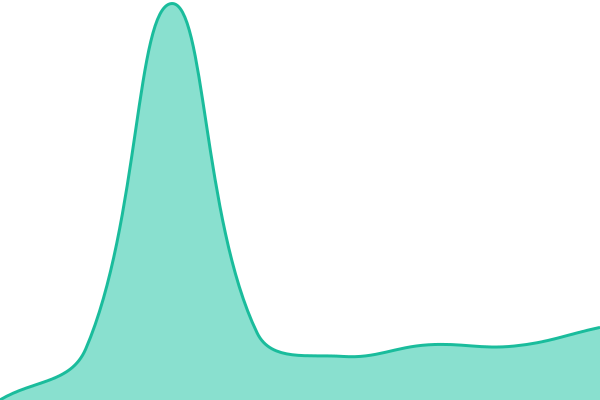

# [📈 Live Status](https://demo.upptime.js.org): <!--live status--> **🟩 すべてのシステムは正常に稼働**

This repository contains the open-source uptime monitor and status page for [manato](https://demo.upptime.js.org), powered by [Upptime](https://github.com/upptime/upptime).

With [Upptime](https://upptime.js.org), you can get your own unlimited and free uptime monitor and status page, powered entirely by a GitHub repository. We use [Issues](https://github.com/manatto/ServiceStatus/issues) as incident reports, [Actions](https://github.com/manatto/ServiceStatus/actions) as uptime monitors, and [Pages](https://demo.upptime.js.org) for the status page.

<!--start: status pages-->
<!-- This summary is generated by Upptime (https://github.com/upptime/upptime) -->
<!-- Do not edit this manually, your changes will be overwritten -->
<!-- prettier-ignore -->
| URL | 状態 | 履歴 | 応答時間 | 稼働時間 |
| --- | ------ | ------- | ------------- | ------ |
|  [コムサプ（本番）](https://komusap.jp) | 🟩 正常 | [コムサプ(本番).yml](https://github.com/manatto/ServiceStatus/commits/HEAD/history/コムサプ(本番).yml) | 

 627ミリ秒
     
 | 

<a href="https://manatto.github.io/ServiceStatus/history/コムサプ(本番)">100.00%</a>
    

|  [コムサプ（開発）](https://komusapu.timeshift.jp) | 🟩 正常 | [コムサプ(開発).yml](https://github.com/manatto/ServiceStatus/commits/HEAD/history/コムサプ(開発).yml) | 

 669ミリ秒
     
 | 

<a href="https://manatto.github.io/ServiceStatus/history/コムサプ(開発)">100.00%</a>
    

|  [lance（本番）](https://reserve.lance-salon.jp) | 🟩 正常 | [lance.yml](https://github.com/manatto/ServiceStatus/commits/HEAD/history/lance.yml) | 

 932ミリ秒
     
 | 

<a href="https://manatto.github.io/ServiceStatus/history/lance">100.00%</a>
    

|  [lance（開発）](https://devreserve.lance-salon.jp) | 🟩 正常 | [lance.yml](https://github.com/manatto/ServiceStatus/commits/HEAD/history/lance.yml) | 

 932ミリ秒
     
 | 

<a href="https://manatto.github.io/ServiceStatus/history/lance">100.00%</a>
    

|  [サークルマネージャー（本番）](https://circlemanager.jp) | 🟩 正常 | [サークルマネージャー(本番).yml](https://github.com/manatto/ServiceStatus/commits/HEAD/history/サークルマネージャー(本番).yml) | 

 1088ミリ秒
     
 | 

<a href="https://manatto.github.io/ServiceStatus/history/サークルマネージャー(本番)">100.00%</a>
    

|  [サークルマネージャー（開発）](https://spopassdev.timeshift.jp) | 🟩 正常 | [サークルマネージャー(開発).yml](https://github.com/manatto/ServiceStatus/commits/HEAD/history/サークルマネージャー(開発).yml) | 

 1586ミリ秒
     
 | 

<a href="https://manatto.github.io/ServiceStatus/history/サークルマネージャー(開発)">100.00%</a>
    

|  [解くサポ（本番）](https://tokusapodev.timeshift.jp) | 🟩 正常 | [解くサポ(本番).yml](https://github.com/manatto/ServiceStatus/commits/HEAD/history/解くサポ(本番).yml) | 

 628ミリ秒
     
 | 

<a href="https://manatto.github.io/ServiceStatus/history/解くサポ(本番)">100.00%</a>
    

|  [解くサポ（開発）](https://tokusapo.timeshift.jp) | 🟩 正常 | [解くサポ(開発).yml](https://github.com/manatto/ServiceStatus/commits/HEAD/history/解くサポ(開発).yml) | 

 746ミリ秒
     
 | 

<a href="https://manatto.github.io/ServiceStatus/history/解くサポ(開発)">100.00%</a>
    

<!--end: status pages-->

[**Visit our status website →**](https://demo.upptime.js.org)

## 📄 License

- Powered by: [Upptime](https://github.com/upptime/upptime)
- Code: [MIT](./LICENSE) © [Anand Chowdhary](https://anandchowdhary.com)
- Data in the `./history` directory: [Open Database License](https://opendatacommons.org/licenses/odbl/1-0/)
